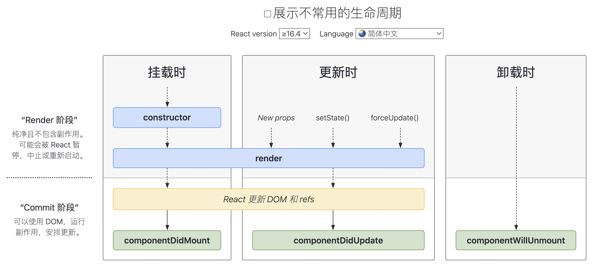

### React 生命周期有哪些？



#### 挂载

当组件实例被创建并插入 DOM 中时，其生命周期调用顺序如下：

```js
// 挂载之前
constructor() 
// 渲染
render()
// 挂载之后
componentDidMount()
```

#### 更新

当组件的 props 或 state 发生变化时会触发更新。组件更新的生命周期调用顺序如下：

- render()
- componentDidUpdate()

#### 卸载

当组件从 DOM 中移除时会调用如下方法：

- componentWillUnmount()

参考： 

[1. React.Component](https://zh-hans.reactjs.org/docs/react-component.html)

[2. 图谱](https://projects.wojtekmaj.pl/react-lifecycle-methods-diagram/)

---

